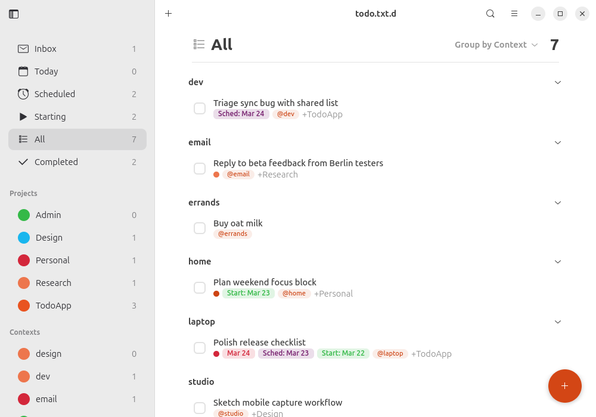
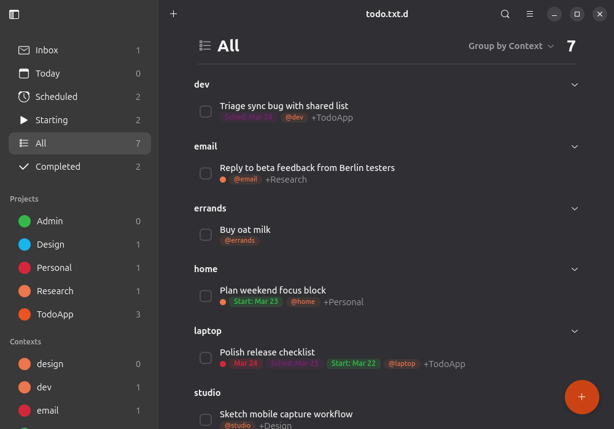
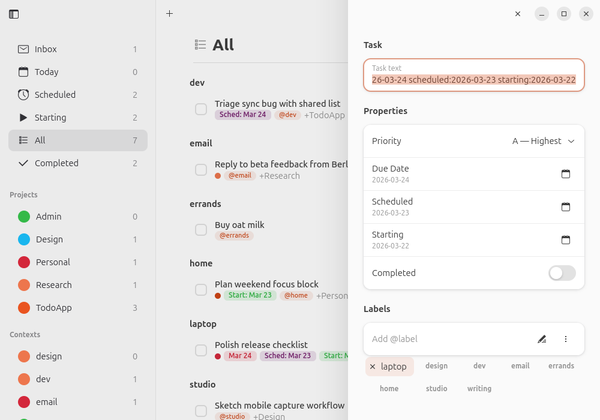
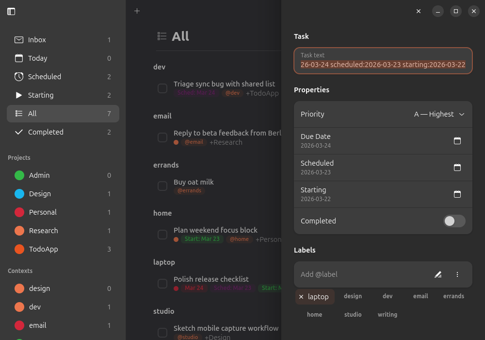
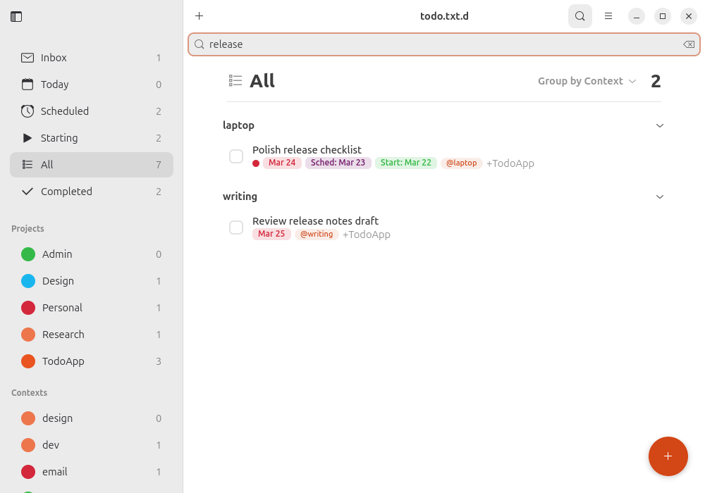
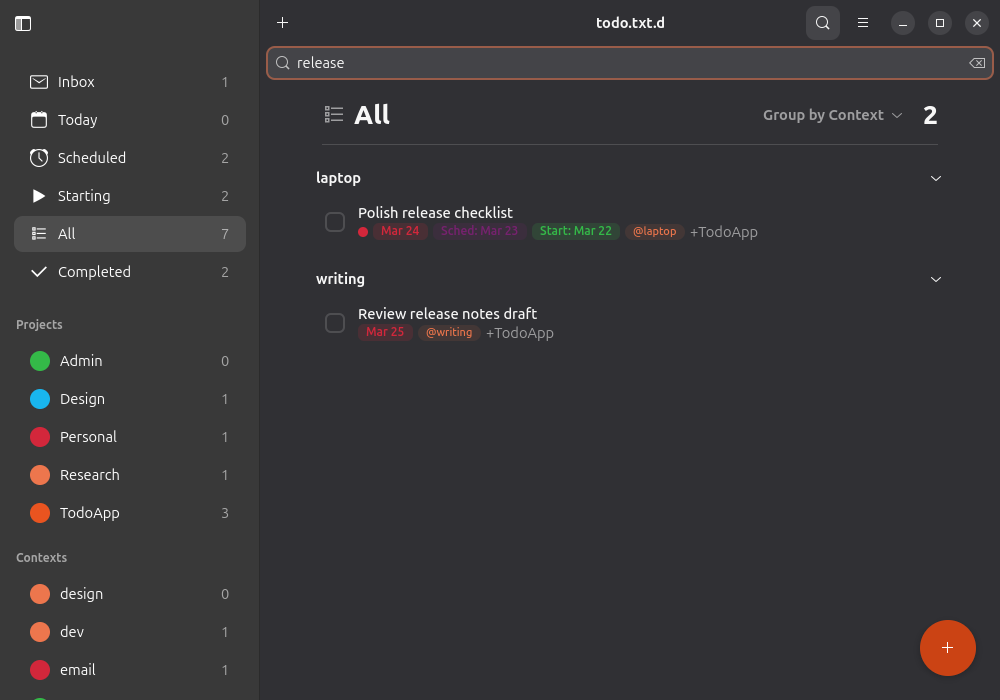

<p align="center">
  
</p>

<h1 align="center">Todo</h1>

A GTK4/libadwaita desktop application for managing `todo.txt.d` task directories.

This project targets GNOME on Wayland. X11 sessions are not supported.

> **Note:** This project is entirely vibe-coded (built with AI assistance).
> Because of that, it won't be published on Flathub — at least for now.

## Screenshots

| View | Light | Dark |
|------|-------|------|
| Overview |  |  |
| Detail panel |  |  |
| Search |  |  |

The gallery images are committed as static README assets.

## Installation

The recommended way to install is to install both the Flatpak app and the
GNOME Shell extension together:

```bash
git clone --recurse-submodules https://github.com/esatbayhan/gnome-todo.git
cd gnome-todo
./install.sh
```

This installs the GNOME SDK/runtime if needed, builds the app, installs it as a
user Flatpak, and installs/enables the GNOME Shell extension.

If you only want to install or update the extension, run:

```bash
./install-extension.sh
```

For quicker extension development iterations, run:

```bash
./install-extension.sh --reload
```

You can then launch the app from your application menu or via:

```bash
flatpak run dev.bayhan.GnomeTodo
```

For day-to-day local rebuilds, `./install.sh` reinstalls the app from the
current project sources while reusing cached dependency downloads. If you want
to refresh pinned sources such as `blueprint-compiler`, run
`./install.sh --refresh-sources`.

### Requirements for building

- `flatpak`
- `flatpak-builder`

On Ubuntu/Debian:

```bash
sudo apt install flatpak flatpak-builder
```

On Fedora:

```bash
sudo dnf install flatpak flatpak-builder
```

On Arch:

```bash
sudo pacman -S flatpak flatpak-builder
```

When adding or changing UI icon names, choose themed icons that exist in the
target Flatpak runtime (`org.gnome.Platform//49`), rather than assuming the
host distro theme provides the same set.

## Configuration

The application resolves its `todo.txt.d` root directory from these sources,
checked in order:

| Variable | Purpose |
|---|---|
| `TODO_DIR` | Path to the `todo.txt.d` root directory |

If `TODO_DIR` is not set, the application checks for a saved directory in
`~/.config/todotxt-gui/config.json`. On first launch (when no directory is
configured), a welcome dialog prompts the user to choose a `todo.txt.d` root.
The directory can be changed later via **Preferences** in the hamburger menu.

## Keyboard shortcuts

| Shortcut | Action |
|----------|--------|
| Ctrl+N | New task |
| Ctrl+F | Search tasks |
| Escape | Close detail panel |
| Ctrl+1–6 | Switch smart filter (Inbox, Today, Scheduled, Starting, All, Completed) |
| F9 | Toggle sidebar |
| Ctrl+, | Preferences |
| Ctrl+? | Keyboard shortcuts |

## The todo.txt.d format

This app uses the [todo.txt.d format](https://github.com/esatbayhan/todo.txt.d): tasks are
stored as `.txt` files inside a `todo.txt.d/` directory, with completed tasks
archived into `todo.txt.d/done.txt.d/`. Each task line keeps the original
todo.txt syntax, including priorities, dates, projects (`+project`),
contexts (`@context`), and `key:value` metadata.

## Project structure

```
meson.build                 Root Meson build definition
dev.bayhan.GnomeTodo.json   Flatpak manifest
cargo-sources.json          Pinned Rust dependency sources for Flatpak
install.sh                  Build & install Flatpak app + extension
install-extension.sh        Install/reload the GNOME Shell extension
data/
    dev.bayhan.GnomeTodo.desktop      Desktop entry
    dev.bayhan.GnomeTodo.metainfo.xml AppStream metadata
    dev.bayhan.GnomeTodo.svg          Application icon
    meson.build                       Installs desktop data files

src/
    meson.build                       Compiles blueprints, bundles GResource,
                                      installs launcher and Python packages
    gnome-todo.in                     Main launcher script template
    gnome-todo-panel.in               Panel CLI launcher template
    dev.bayhan.GnomeTodo.gresource.xml
    style.css                         Custom styles

    ui/
        *.blp                         Blueprint UI definitions

    gnome_todo/
        app.py                  Application entry point
        _window.py              Main window (sidebar, content, detail split view)
        _window_state.py        Window state persistence
        _content.py             Content header, task rows, task sections
        _content_header.py      Content pane header with grouping menu
        _detail_panel.py        Right-side task detail/edit panel
        _detail_panel_tags.py   Project/context chip rendering
        _dialogs.py             Add-task dialog with property pickers
        _sidebar.py             Smart filter list and project/context lists
        _sidebar_state.py       Sidebar state dataclass
        _task_row.py            Rich two-line task row widget
        _task_row_state.py      Task row state management
        _widgets.py             Small reusable widget factories
        _config.py              Persistent JSON configuration
        _core.py                File path resolution
        _file_monitor.py        External file change detection
        _preferences.py         Preferences dialog
        _shortcuts.py           Keyboard shortcuts
        _welcome.py             First-launch welcome dialog
        _ui.py                  GResource path constant
        panel_cli.py            Shell extension quick-add CLI

extensions/
    gnome-todo-shell-ext@dev.bayhan/
        metadata.json           Extension manifest
        extension.js            Extension logic
        stylesheet.css          Extension styles

vendor/
    ttd-core/                   Rust core library (git submodule)
        src/                    Rust implementation
        bindings/python/        Generated Python FFI bindings (ttd_core package)

tests/
    lib/                    Unit tests for the ttd_core library
    gui/                    Unit tests for gnome_todo
```

## Design principles

- **Native appearance.** The application uses libadwaita widgets and built-in
  CSS classes wherever possible. Custom CSS is limited to elements with no
  Adwaita equivalent: project circle colors, priority dots, due-date badges,
  context chips, subtle task-row states, drag previews, and the FAB button.

- **Flat task lists over card chrome.** The main task view uses quiet,
  list-like rows instead of per-task cards, to stay closer to GNOME's native
  content views and to keep grouped task sections readable.

- **Blueprint for layout, Python for logic.** Static widget trees are declared
  in `.blp` files. Dynamic content (task lists, filter counts, chip creation)
  is handled in Python.

- **Multiple assignment paths.** Projects and contexts can be assigned through
  drag-and-drop, direct typing, inline suggestions, or quick pickers in the
  detail panel, so the feature remains usable with different input styles.

- **Plain-text storage.** Your data lives in a `todo.txt.d/` directory with one
  plain-text task per file by default, plus `done.txt.d/` for completed tasks.

- **Sync-friendly.** `todo.txt.d/` is designed for file-based syncing tools
  like Syncthing or Nextcloud. The application monitors the task directories
  for external changes and automatically reloads when tasks are modified
  outside the app.

## Contributing

Contributions are welcome! See [CONTRIBUTING.md](CONTRIBUTING.md) for
development setup and guidelines.

## License

[MIT](LICENSE) — Copyright (c) 2026 Esat Bayhan
